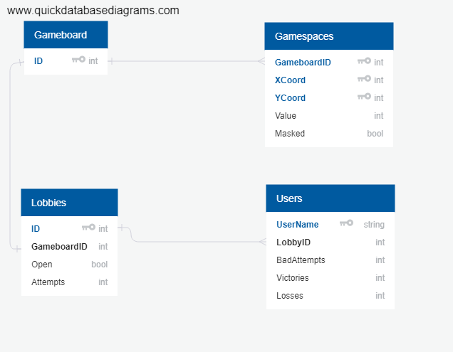
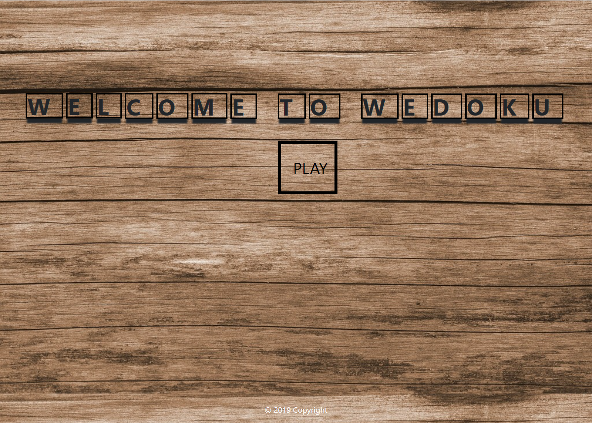
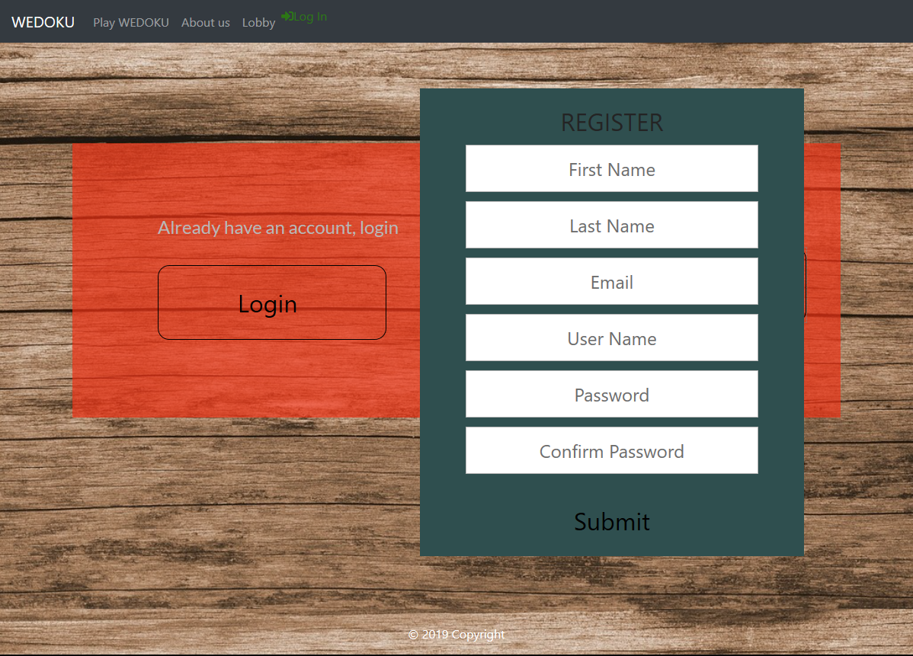
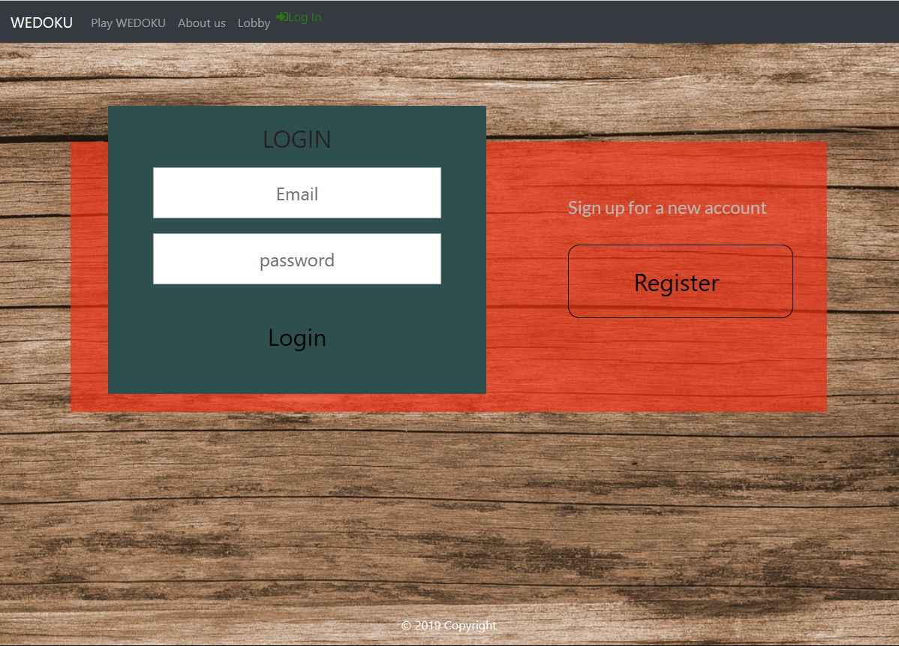
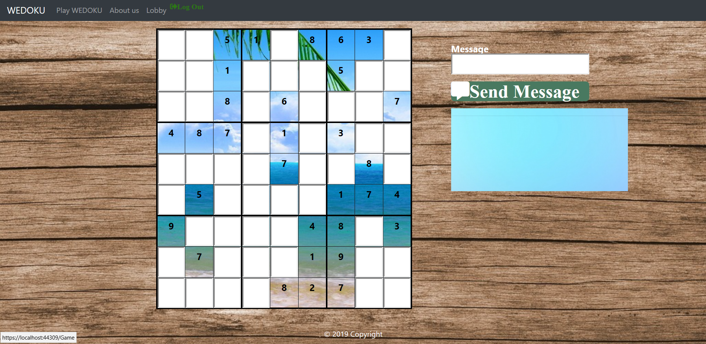
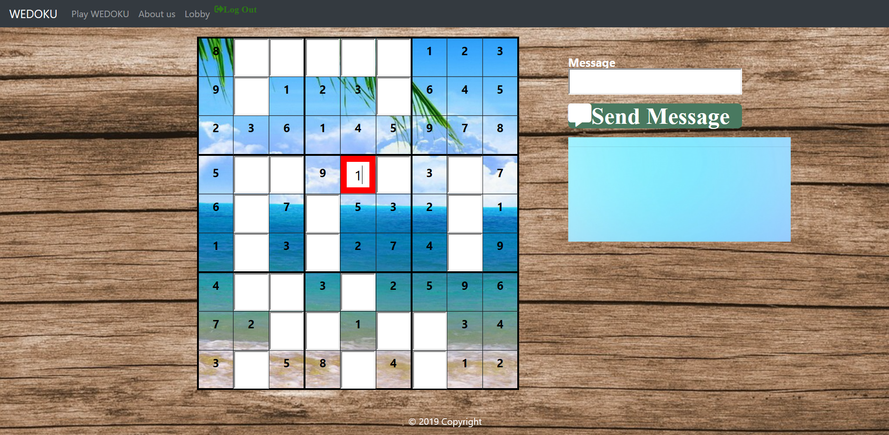
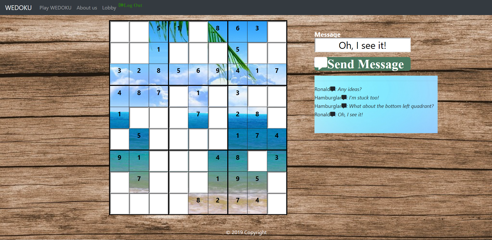
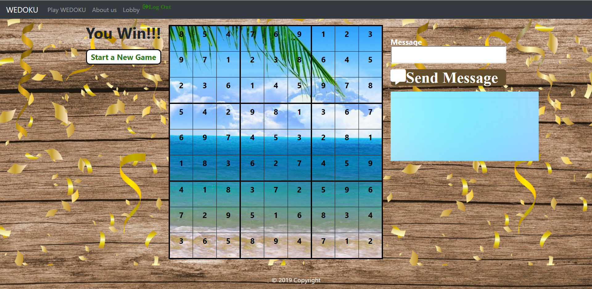
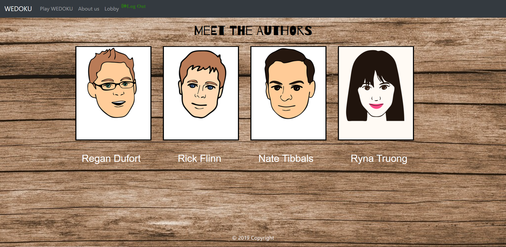

# We-Doku

An interactive multiplayer Sudoku platform that creates an environment where like minded players can collaborate to solve a Sudoku puzzle. [View Deployed Version Here](https://wedoku.azurewebsites.net/)

## Technologies, Tools and Libraries

### Languages

- C#
- JavaScript
- CSS
- HTML
- SQL


### Libraries and Frameworks

- ASP.Net Core
- EntityFrameworkCore
- Signal R
- JQuery

### Tools

- Visual Stuio
- Azure Dev Ops
- Git
- Github
- Draw IO


## Schema



## Set Up Instructions - Local Machine
- Fork the Wedoku repository.
- Open project in Visual Studios.
- Open user secrets. Establish a default connection of your local host. 
```
    "DefaultConnection": "Server=(localdb)\\MSSQLLocalDB;Database=sudoku;Trusted_Connection=True;MultipleActiveResultSets=True",
    "DefaultUserConnection": "Server=(localdb)\\MSSQLLocalDB;Database=ApplicationUserDbContext;Trusted_Connection=True;MultipleActiveResultSets=true",
```
- Double check for any build errors.
- Open up your Package Management Console.
- Type text "Add-Migration" and hit enter.
- You will be prompted to add a name. This is semantic and can be anything.
- Once migration has been added, type text "Update Database" and hit enter.
- You now have a database set up for your program.
- Run program with IIS Express.
- Note: The database is pre-seeded with a gameboard. 

## User Instructions and Walkthrough
- Upon opening the web page, please select "Enter".
- During your first visit, please select "Register on the right hand side of the page. Simply enter in your First Name, Last Name, Email, User Name along with a Password(and confirmation).
- Once Registered, you will have access to play "We-Doku".
- From the Game page, you can have the ability to interact with the Sudoku board along with anyone else who may be on the site at that time.
- In addition, you have fully Chat access and will see messages from other users in real-time. 
- While on on the Game Page, you can enter in any number from 1-9 within a board square.
- After you've input a number, simply click into another box or hit enter to validate your move.
- If it is a correct placement, the number will appear and another piece of the background puzzle will be revealed.
- If it is an incorrect move, the box will display a red outline.
- Upon your first consecutive incorrect move, the game board will also shake.
- All incorrect moves thereafter will remain outlined in red until a correct moe is made.
- Upon successful completion of properly filling in all squares, confetti will rain down the page and a button will appear to the right of the page asking if you'd like to play again.
- Alternatively, you can simply reload the page where a new game board will appear.
- When a new game is initiated, a new board will randomly be generated.
- One game runs at a time and will run until completed.
- As such, you and your friends can access the same game but also finished whatever game is currently going on.


## Images

#### Landing Page


#### Login and Registration 



#### Game Board


#### Game Board - In Action



#### Game Board - Completion


#### About Us 


## Contributors

- Nate Tibbals
- Richard Flinn 
- Regan Dufort
- Tyna Truong